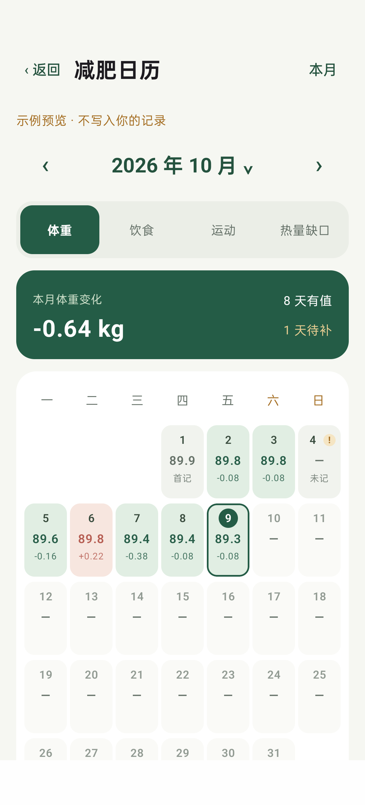
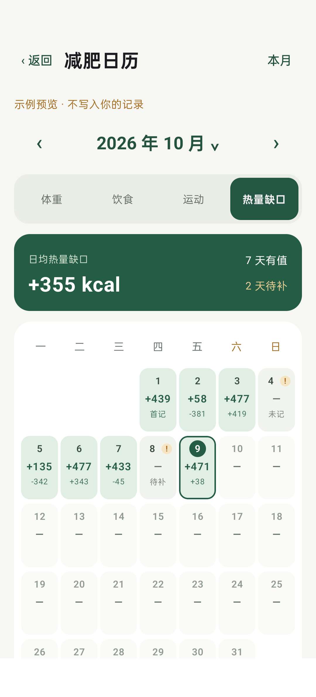
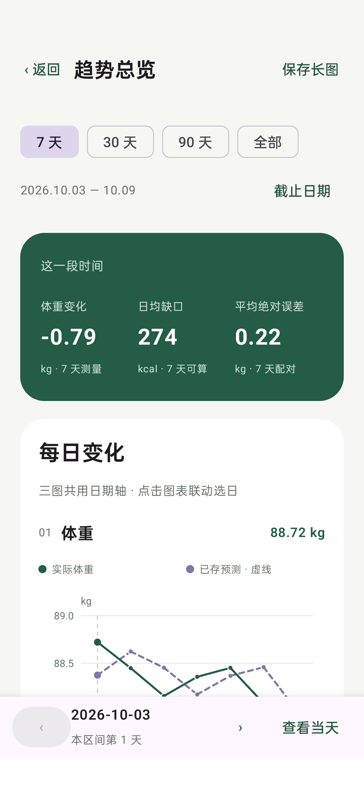
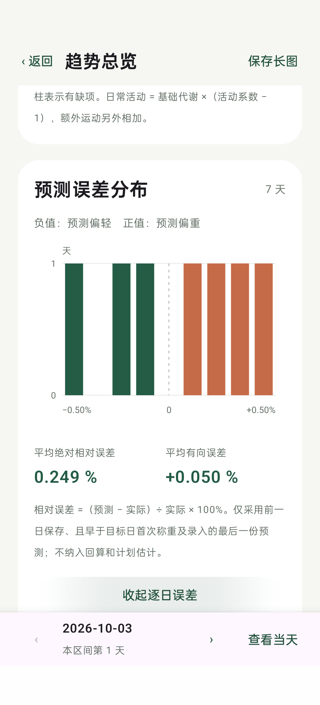

# MealLog · 食记

**把饮食、运动和体重记在一起，让每天的能量收支有据可查。**

MealLog 是一款中文 Android 记录应用。它把日常记录、热量试算、体重趋势和月度日历串联起来，并提供固定格式的数据导出，方便在电脑上进一步分析：记录是否完整、预测和实测相差多少，以及模型参数是否适合自己的长期数据。

当前版本：**0.3.0** · Android **8.0 / API 26** 及以上 · Kotlin + Jetpack Compose + Room

应用使用手机本地存储，无需注册账号。当前版本没有联网同步或照片识别服务。

## 界面预览

**以下全部是自动生成的模拟数据截图，不包含真实个人记录、饮食照片或个人资料。**

<table>
  <tr>
    <th>体重日历</th>
    <th>热量缺口日历</th>
  </tr>
  <tr>
    <td></td>
    <td></td>
  </tr>
  <tr>
    <th>每日趋势</th>
    <th>预测误差分布</th>
  </tr>
  <tr>
    <td></td>
    <td></td>
  </tr>
</table>

## 可以记录什么

| 类型 | 记录内容 | 处理方式 |
| --- | --- | --- |
| 体重 | 测量时间、体重、备注 | 同一天可多次记录；每日分析取时间上最后一次测量 |
| 饮食 | 进食时间、名称、重量、热量、照片、备注 | 重量、热量、照片可留空；支持从相册选择或拍照 |
| 运动 | 开始时间、名称、时长、消耗或 MET、备注 | 手动填写能量，或由 MET、当天体重和时长估算 |

每条记录均保留发生时间、创建时间、最后修改时间和独立编号。可以补记历史日期，也可以修改、删除已有记录。

### 自动单位换算

| 数据 | 可输入单位 | 统一存储单位 |
| --- | --- | --- |
| 体重 | kg、斤、磅 | kg |
| 食物重量 | g、kg、斤、两 | g |
| 运动时长 | 分钟、小时、秒 | 分钟 |
| 能量 | kcal、kJ | kcal |

采用 `1 斤 = 500 g`、`1 两 = 50 g`、`1 磅 = 0.45359237 kg`、`1 kcal = 4.184 kJ`。重量和热量分别记录，食物克数不会自动换算成热量。

## 页面与使用流程

首页保留三个常用入口：**＋体重、＋饮食、＋运动**。上方选择日期，中间通过三个页签查看当天数据：

| 页面 | 用途 |
| --- | --- |
| 时间线 | 按发生时间查看当天记录，可筛选类型 |
| 每日汇总 | 分别查看饮食、运动、体重列表，进入编辑或删除 |
| 分析 | 核对模型设置，查看能量收支，保存计算快照 |
| 日历 | 在整个月份中发现变化和缺项，点击日期进入当天汇总 |
| 趋势 | 查看连续多日变化、预测误差，定位日期或保存长图 |
| 导出 | 按起止日期生成包含 CSV、JSON 和照片的 ZIP 文件 |

推荐的日常流程：

1. 称重后记录体重和测量时间；饮食、额外运动发生后分别记录。
2. 第一次使用分析功能时，确认自己的身高、年龄、公式参数、活动系数和 λ。
3. 当天结束时检查汇总。在分析页确认已记录全天饮食和额外运动后，保存当日预测快照。
4. 下一日继续记录体重，趋势页会根据有效的事前快照形成预测与实测配对。
5. 定期导出数据，在电脑上进一步检验模型。

未确认个人参数前，基础代谢和体重预测保持空白。首次安装的预填参数只是通用占位示例。

## 减肥日历

日历按自然月显示，周一为每周第一天，自动适配 28–31 天、闰月和四至六行的月份布局。支持前后翻月、跳转年月和回到本月。

选择栏可切换 **体重 / 饮食 / 运动 / 热量缺口**：

- 主数值：当天最后体重、饮食摄入合计、额外运动消耗合计或模型热量缺口。
- 小字：较上一次该指标数据有效的记录日的变化。跨越漏记日期时，不把中间的空值当作零。
- 体重、饮食和运动用红色表示上升、绿色表示下降；颜色只表示方向，不是健康评价。
- 热量缺口用绿色表示正缺口，红色表示热量盈余。
- `!` 表示所选项目未记录或缺少必要数据；`≈` 表示只有部分能量已知。
- 缺项提醒覆盖开始记录后的日期至今天，未来日期不提醒。完全没有记录时只提醒今天。

点击任意日期进入当天的每日汇总，可直接补记。返回日历时保留月份和所选指标。顶部卡片显示本月首末有效体重之差，或有效记录日的平均能量值，以及有值、待补天数。

## 能量与体重模型

这些公式描述应用当前的计算方式，用于对照个人记录检验模型；输出是估计值，不是次日秤重的保证。

### 1. 基础代谢与总消耗

基础代谢使用 Mifflin–St Jeor 估计式。设体重为 `W kg`、身高为 `H cm`、年龄为 `A`：

```text
BMR = 10 × W + 6.25 × H − 5 × A + 性别参数
性别参数：男性公式 +5；女性公式 −161

日常消耗 = BMR × 日常活动系数
总消耗   = 日常消耗 + 额外运动消耗
```

**额外运动始终在活动系数之外全额相加**，与应用的记录约定一致。因此填写活动系数时，应让它代表平常生活，避免把同一段额外运动重复计入。

运动优先使用手动输入的热量。采用 MET 时：

```text
额外运动 kcal = MET × 当天最后体重 kg × 1.05 × 运动时长小时
```

### 2. 热量缺口与次日体重

```text
热量缺口 kcal = 总消耗 − 饮食摄入
预计体重变化 kg = −热量缺口 ÷ λ
理论次日体重 kg = 当天最后体重 + 预计体重变化
```

正缺口表示消耗高于摄入，负缺口表示盈余。`λ` 默认 `7500 kcal/kg`，可以调整。水分、糖原、胃肠内容物及称重时间会影响实际体重；应结合连续数据解释误差。

### 3. 固定快照与预测误差

直接显示的试算使用当前记录和当前参数；主动保存的快照固定保留当时的参数、输入汇总、结果、模型版本和记录指纹。后续修改记录或参数不会覆盖旧快照。

| 快照类型 | 保存场景 | 是否用于事前预测误差 |
| --- | --- | --- |
| `same_day_estimate` | 当天的估计 | 符合时间条件时使用 |
| `retrospective` | 历史日期回算 | 不使用 |
| `planned` | 未来日期计划估计 | 不使用 |

误差分析只把前一日有效快照配对到紧邻的下一日，选取目标日任一次称重或体重录入之前保存的最后一个有效预测。没有次日实测则没有误差，不会拿更晚日期补配对。

```text
误差 kg = 预测体重 − 实际体重
相对误差 % = (预测体重 − 实际体重) ÷ 实际体重 × 100
```

实际体重使用目标日最后一次测量。正误差代表预测偏高，负误差代表预测偏低。历史实测记录如果被修改，配对误差也会随之更新，预测快照本身不变。

## 趋势与长图

支持最近 **7 / 30 / 90 天 / 全部**，并可修改结束日期。

同一组按日排列的图表展示：

1. 实际体重和已保存的有效预测体重。
2. 饮食摄入与消耗；消耗拆成基础代谢、日常活动增量、额外运动三项。
3. 每天的热量缺口或盈余。

独立区域展示相对预测误差分布，并可展开逐日配对明细。点图表或使用日期按钮定位某一天，再进入当天记录。**保存长图**会输出一张包含多项分析的 PNG，方便电脑查看或留档。

## 漏记与空值

- 空白表示未知，明确填写的 `0` 表示零；两者不会混用。
- 没有当天体重时，不借用其他日期体重生成当天 BMR、MET 消耗或体重预测。
- 有饮食记录但缺少热量时，不生成完整摄入曲线或热量缺口；已知部分仍能在记录汇总中查看。
- 有运动记录但消耗无法计算时，总消耗和缺口保持空白。
- 没有运动记录时，当前试算没有额外运动加项；这不意味着已经确认当日没有运动，运动日历仍显示未记录。
- 漏记日期在趋势的时间轴上保留位置，图表跳过空值；必填项为空时显示输入提示，不保存无效记录。

## 固定格式导出

导出格式版本：**1.2**。选择日期范围后，应用通过系统文件选择器保存 ZIP。

| 文件 | 内容 |
| --- | --- |
| `weights.csv` | 全部体重测量和时间 |
| `meals.csv` | 饮食重量、热量、照片路径和备注 |
| `exercises.csv` | 运动时长、手填热量、MET 和计算方式 |
| `daily_summary.csv` | 有记录日期的分类计数与已知数值汇总 |
| `analysis.csv` | 按导出时当前设置重算的逐日结果 |
| `trend_daily.csv` | 连续日期的图表数据，保留空白日期 |
| `prediction_errors.csv` | 符合条件的预测与实测配对误差 |
| `prediction_snapshots.csv` | 已保存的模型快照及必要的前一日配对快照 |
| `records.json` | 结构化原始明细，保留 `null` |
| `model_settings.json` | 导出时的模型参数与确认状态 |
| `manifest.json` | 格式版本、范围和记录数量 |
| `README.txt` | 随导出包附带的字段及计算说明 |
| `photos/` | 记录所关联的照片副本 |

CSV 使用固定英文列名、UTF-8 BOM、CRLF 换行和标准双引号转义；可用 Excel 查看。数值统一采用 kg、g、min、kcal，时间使用带时区偏移的 ISO 8601。可能被表格软件解释为公式的文本会在 CSV 中做防护，原文仍保留在 JSON。

详细字段、空值约定和 Python 读取例子见 [导出格式说明](docs/export-format.md)。**当前支持导出，不支持从 ZIP 导入恢复。**

## 本地数据与隐私

记录、模型快照和照片保存在手机本地；模型设置使用本地偏好存储。应用没有 `INTERNET` 权限，不包含云同步、广告或分析 SDK，且关闭了 Android 自动备份。图片由用户主动选择或拍摄后复制到应用存储。

仓库只包含源码、测试、构建配置和模拟截图。原始个人笔记、真实导出数据、数据库、照片、设备日志、SSH 密钥、签名文件及 `local.properties` 不提交。示例截图由内存中的测试数据渲染，不从用户数据库提取。

导出包本身可能包含个人资料、记录和照片，请自行选择保存和分享位置。

## 构建与运行

### 环境

| 项目 | 版本 |
| --- | --- |
| JDK | 17 或 21；本项目验证环境为 21 |
| Gradle | 8.13，已包含 Wrapper |
| Android Gradle Plugin | 8.13.2 |
| Kotlin / Compose 插件 | 2.2.21 |
| Android SDK | Compile / Target API 36 |
| Android Build Tools | 35.0.0 |
| 最低 Android | API 26 |
| Compose BOM | 2025.10.00 |
| Room | 2.8.4 |

可以用 Android Studio 打开项目，也可以只安装 JDK 和 Android SDK 命令行工具。设置 `JAVA_HOME`，通过 `ANDROID_HOME` 或本机 `local.properties` 指定 SDK 路径。`local.properties` 不进入版本控制。

首次构建需要下载 Gradle 和依赖，并接受 Android SDK 许可。SDK 需要 `platform-tools`、`platforms;android-36` 和 `build-tools;35.0.0`。

Windows PowerShell：

```powershell
.\gradlew.bat assembleDebug testDebugUnitTest
```

macOS / Linux：

```sh
./gradlew assembleDebug testDebugUnitTest
```

输出安装包：`app/build/outputs/apk/debug/app-debug.apk`。

手机启用开发者选项、USB 调试并允许此电脑后：

```sh
adb devices
adb install -r app/build/outputs/apk/debug/app-debug.apk
```

`-r` 用于保留数据的覆盖安装；更新 APK 需要与现有安装使用同一签名。另一台电脑自动生成的调试签名可能不同，请不要为解决签名冲突而直接卸载唯一的数据副本。

### 测试

```powershell
# 本地：单位换算、模型、导出、预测配对、缺项和日历日期
.\gradlew.bat testDebugUnitTest

# USB 手机或模拟器：页面操作、空数据、持久化及模拟截图
.\gradlew.bat connectedDebugAndroidTest
```

当前单元测试覆盖 28 个用例，包括 100 种稀疏数据组合。手机测试覆盖记录校验、趋势交互、日历切换、详情返回、独立测试数据库持久化和长图生成。

## 项目结构

```text
app/src/main/java/com/self/diet/
├── MainActivity.kt          # 首页、记录列表与编辑器
├── DietViewModel.kt         # 本地状态、保存和导出
├── Data.kt                 # Room 实体与 DAO
├── Units.kt                # 单位转换与输入校验
├── EnergyModel.kt          # BMR、额外运动、预测和固定快照
├── AnalysisUi.kt           # 每日分析及参数设置
├── DietCalendar.kt         # 月份、指标、变化和缺项计算
├── CalendarScreen.kt       # 月度日历界面
├── Trends.kt               # 日序列、事前预测配对与误差统计
├── TrendsScreen.kt         # 趋势页面与交互
├── TrendCharts.kt          # 共用图表绘制
├── TrendsImage.kt          # 合并 PNG 长图
├── Export.kt               # CSV / JSON / ZIP 导出
└── PhotoFiles.kt           # 照片本地副本
```

`app/src/test/` 为纯逻辑测试，`app/src/androidTest/` 为手机测试，`app/schemas/` 保存 Room 数据库结构，`docs/images/` 保存经过检查的模拟截图。

## 当前边界

食物热量需要手动输入；照片只作为记录附件。当前没有条码扫描、营养数据库、云同步、账号系统或导入恢复。应用中的体重预测是一日能量折算，模型参数可调整，不能把单日秤重误差直接视为脂肪变化。

当前仓库未指定开源许可证。
